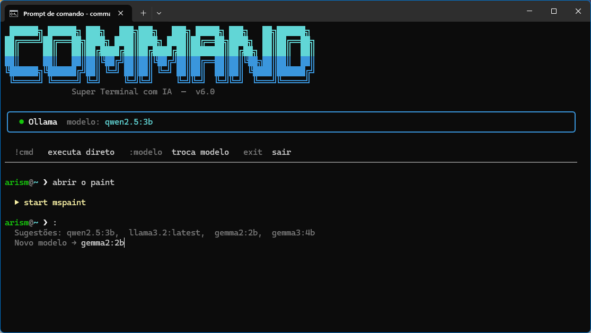

# Command
Super terminal com IA para Windows, macOS e Linux — powered by **Ollama** (local) ou **OpenAI** (online).



## Instalação rápida

**Windows**

```powershell
powershell -ExecutionPolicy Bypass -c "irm https://raw.githubusercontent.com/arismarioneves/Command/main/install.ps1 | iex"
```

**macOS / Linux**

```bash
curl -fsSL https://raw.githubusercontent.com/arismarioneves/Command/main/install.sh | bash
```

O instalador pergunta o modo desejado:

```
  Escolha o modo de funcionamento:

    [1] Local   — Ollama + qwen2.5:3b  (gratuito, roda na sua maquina)
    [2] Online  — OpenAI API           (requer chave, sem download de LLM)
```

- **Modo Local:** instala Ollama e baixa o modelo `qwen2.5:3b` (~2 GB). Sem custos, funciona offline.
- **Modo Online:** pede sua `OPENAI_API_KEY` e usa `gpt-5-nano`. Nenhum download de LLM necessário.

O provider fica salvo no `.env`. Para trocar de provider (Ollama ↔ OpenAI), basta reinstalar.

> **Windows:** o comando é `command` — **macOS/Linux:** o comando é `cmd` (`command` é um builtin do bash/zsh e não pode ser sobrescrito pelo PATH).

## Instalação manual

Em ambos os modos é necessário um arquivo `.env` na mesma pasta do `command.py`. Copie o exemplo e ajuste:

```bash
cp .env.example .env    # macOS/Linux
copy .env.example .env  # Windows
```

**Modo local — Ollama:**

```env
PROVIDER=ollama
MODELO_ATUAL=qwen2.5:3b
```

```bash
ollama pull qwen2.5:3b
pip install -r requirements.txt
python command.py         # Windows
python3 command.py        # macOS/Linux
```

**Modo online — OpenAI:**

```env
PROVIDER=openai
MODELO_ATUAL=gpt-5-nano
OPENAI_API_KEY=sk-...
```

```bash
pip install -r requirements.txt
python command.py         # Windows
python3 command.py        # macOS/Linux
```

---

## Uso

O prompt mostra o diretório atual como um terminal real:

```
root@C:\DEV\Command> abra o vscode aqui
  $ code .

root@C:\DEV\Command> crie uma pasta dog com um arquivo boing.txt dentro
  $ mkdir dog
  $ copy nul dog\boing.txt

root@C:\DEV\Command> !git status
On branch main
nothing to commit, working tree clean

root@C:\DEV\Command> :llama3.2
  modelo → llama3.2
```

Para trocar com sugestões interativas, digite apenas `:` e pressione Enter — o terminal lista os modelos disponíveis e pede para você escolher:

```
root@C:\DEV\Command> :
  Sugestões: qwen2.5:3b,  gemma3:1b,  gemma3:4b,  llama3.2,  mistral
  Novo modelo → [você digita aqui]
```

## Comandos especiais

| Entrada | Ação |
|---|---|
| `!<cmd>` | Executa diretamente sem passar pela IA |
| `:` | Troca o modelo (mostra sugestões e pede o nome) |
| `:<modelo>` | Troca direto para o modelo informado |
| `sair` / `exit` | Encerra o terminal |

## Modo direto (`!`)

Use `!` para rodar qualquer comando sem IA:

```
!dir              # Windows
!ls               # macOS/Linux
!git log --oneline -5
!python app.py
!npm install
```

## Modelos suportados

**Ollama (local, gratuito):**

| Modelo | Tamanho | Indicado para |
|---|---|---|
| `qwen2.5:3b` | 2 GB | código e comandos (padrão) |
| `gemma3:1b` | 800 MB | máquinas com pouca RAM |
| `gemma3:4b` | 3 GB | raciocínio |
| `llama3.2` | 2 GB | uso geral |
| `mistral` | 4 GB | uso geral avançado |

**OpenAI (online):**

| Modelo | Descrição |
|---|---|
| `gpt-4o-mini` | GPT-4o mini — rápido e econômico |
| `gpt-4.1-mini` | GPT-4.1 mini — econômico, geração mais recente |
| `gpt-4.1-nano` | GPT-4.1 nano — ultra leve e barato |
| `gpt-5-mini` | GPT-5 mini — capacidade avançada com baixo custo |
| `gpt-5-nano` | GPT-5 nano — mais leve da família GPT-5 (padrão) |

Para usar qualquer outro modelo do Ollama ou OpenAI, basta digitá-lo com `:`.

## Variáveis de ambiente (`.env`)

| Variável | Padrão | Descrição |
|---|---|---|
| `PROVIDER` | — | Provider ativo: `ollama` ou `openai` |
| `MODELO_ATUAL` | — | Modelo em uso (atualizado automaticamente ao trocar) |
| `OPENAI_API_KEY` | — | Chave OpenAI (obrigatória no modo online) |
| `USUARIO` | `root` | Nome no prompt |
| `OLLAMA_URL` | `http://localhost:11434` | Endereço do Ollama |

## Segurança

Comandos destrutivos são bloqueados automaticamente em todos os sistemas operacionais:
- **Windows:** `format c:`, `del /f /s /q c:\`, etc.
- **macOS/Linux:** `rm -rf /`, `sudo rm -rf /`, `mkfs`, etc.
ocalhost:11434` | Endereço do Ollama |

## Segurança

Comandos destrutivos (`format c:`, `del /f /s /q c:\`, etc.) são bloqueados automaticamente.
ocalhost:11434` | Endereço do Ollama |

## Segurança

Comandos destrutivos (`format c:`, `del /f /s /q c:\`, etc.) são bloqueados automaticamente.
